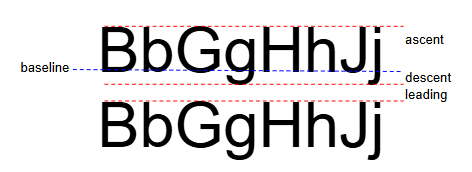

# FontMetricsGFX

This is a sketch to measure the sizes in pixels of the Arduino GFX free fonts when rendered on a CYD. It is useful to know these sizes so you know how much space to leave for text, or how much of the screen you need to fill to erase text. The free fonts used by the TFT_eSPI and LovyanGFX libraries appear to be the same sizes so this applies to all the libraries.



When you write text in the free fonts the baseline is positioned at the current cursor position. Then the characters extend above the baseline by the _ascent_, and they extend below the baseline by the _descent_. If you take the maximum ascent and maximum descent for all the characters in the font and add them you get the minimum spacing required between lines for the characters not to overlap. This distance is usually equal to the advertised size of the font in points.

The ArduinoGFX fonts assume they are being rendered on an Adafruit 2.8" 320 x 240 display that has a vertical height of about 43 mm. This means they are rendered at about 141 pixels per inch, so for example the 12 point font is 12 x 141/72 = 24 pixels high.

The code here examines the font to determine:

- the line depth = ascent + descent + leading. This is the vertical space you get if you print a '\n' character.

- the character depth = ascent + descent. This is the minimum vertical spacing to ensure the text doesn't overlap the lines above or below.

- the maximum descent. You need to know this to make sure you leave enough space below the current cursor position for the descenders.

So for example you can erase text written using something like:

```
fillRect(0, getCursorY() - line_depth + descent, SCREEN_WIDTH, line_depth, BACKGROUND_COLOUR);
```

I have measured the sizes for the 9pt, 12pt, 18pt and 24pt fonts included with the ArduinoGFX library, and I've put these in `FontMetricsGFX.h` so this can be included in your program. Alternatively you can use the `GetGFXFontMetrics()` function from this code to find the size of whatever font you want to use.